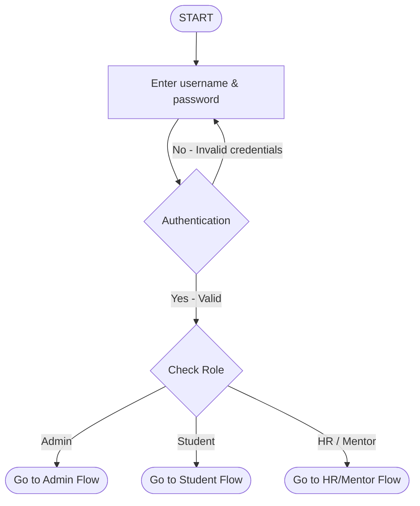
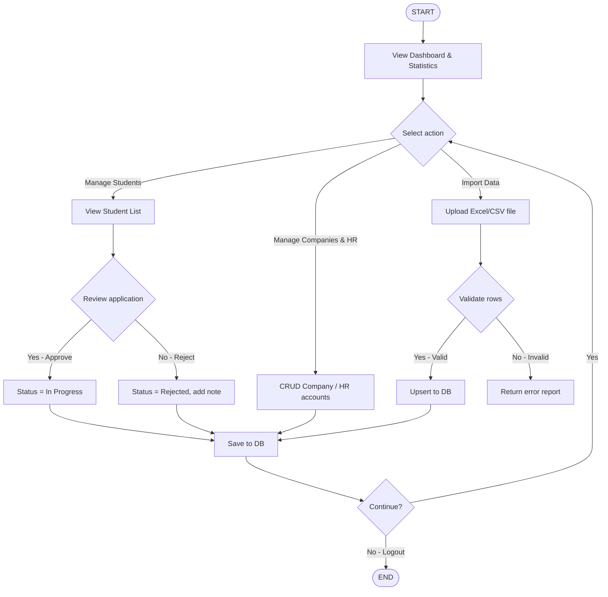
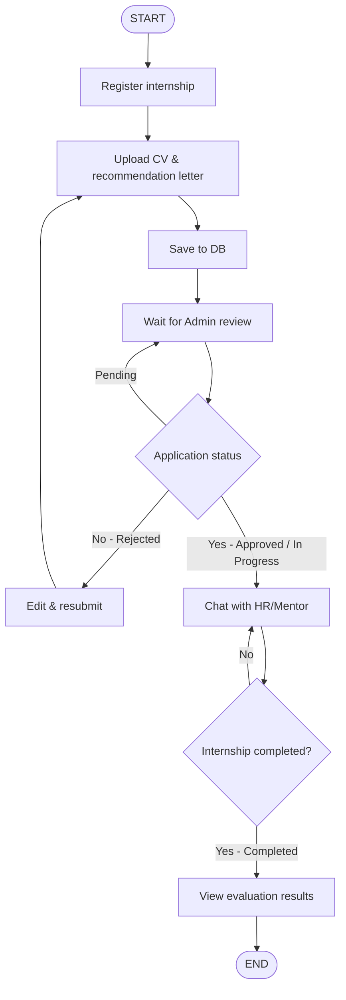
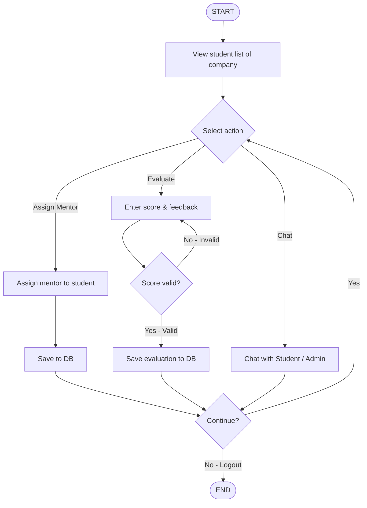
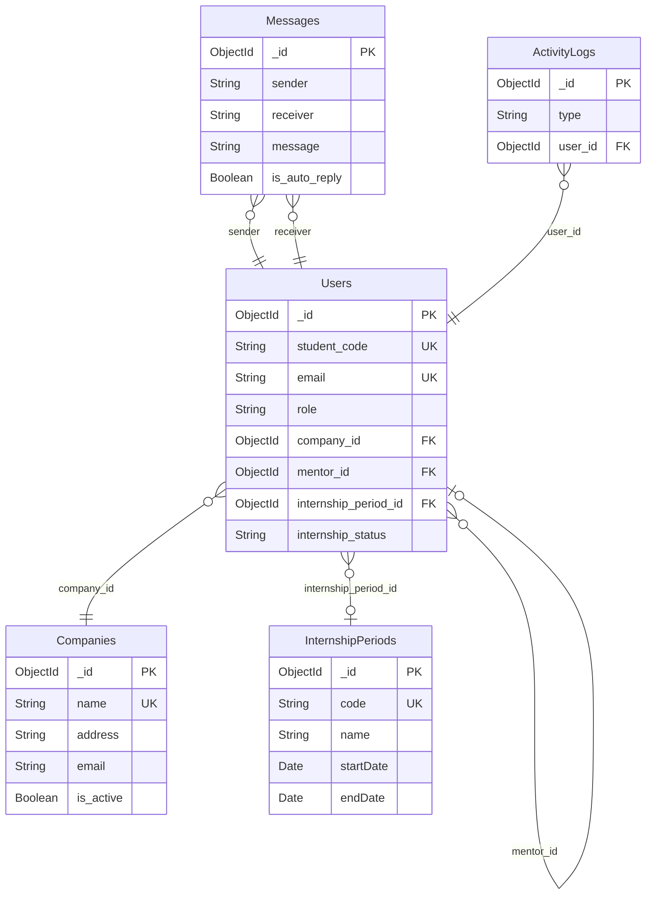

# BÁO CÁO THỰC TẬP

# XÂY DỰNG WEBSITE QUẢN LÝ THỰC TẬP SINH

**Đơn vị thực tập:** Trung tâm Công nghệ thông tin tỉnh Lào Cai  
**Năm:** 2026

---

## MỤC LỤC

- [Danh mục viết tắt](#danh-muc-viet-tat)
- [Danh mục hình ảnh](#danh-muc-hinh-anh)
- [Danh mục bảng](#danh-muc-bang)
- [Lời mở đầu](#lời-mở-đầu)
  - [1. Lý do chọn đề tài](#1-lý-do-chọn-đề-tài)
  - [2. Mục tiêu đề tài](#2-mục-tiêu-đề-tài)
  - [3. Kết quả mong muốn](#3-kết-quả-mong-muốn)
  - [4. Kết cấu của báo cáo](#4-kết-cấu-của-báo-cáo)
- [Chương 1: Tổng quan về đơn vị thực tập](#chương-1-tổng-quan-về-đơn-vị-thực-tập)
- [Chương 2: Cơ sở lý thuyết và Phân tích thiết kế hệ thống](#chương-2-cơ-sở-lý-thuyết-và-phân-tích-thiết-kế-hệ-thống)
- [Chương 3: Triển khai xây dựng và Kết quả đạt được](#chương-3-triển-khai-xây-dựng-và-kết-quả-đạt-được)
- [Kết luận](#kết-luận)
- [Tài liệu tham khảo](#tài-liệu-tham-khảo)
- [Phụ lục](#phụ-lục)

---

## DANH MỤC VIẾT TẮT

<a id="danh-muc-viet-tat"></a><a id="bang-viet-tat"></a>

| STT | Từ viết tắt | Nguyên nghĩa / Giải thích |
|-----|-------------|---------------------------|
| 1 | API | Application Programming Interface – Giao diện lập trình ứng dụng |
| 2 | CORS | Cross-Origin Resource Sharing – Chia sẻ tài nguyên chéo nguồn |
| 3 | CRUD | Create, Read, Update, Delete – Tạo, Đọc, Cập nhật, Xóa |
| 4 | CSV | Comma-Separated Values – Dữ liệu tách bằng dấu phẩy |
| 5 | CNTT | Công nghệ thông tin |
| 6 | DB | Database – Cơ sở dữ liệu |
| 7 | HTTP | Hypertext Transfer Protocol – Giao thức truyền tải siêu văn bản |
| 8 | HTTPS | HTTP Secure – HTTP bảo mật (mã hóa SSL/TLS) |
| 9 | HR | Human Resources – Nhân sự |
| 10 | JSON | JavaScript Object Notation – Định dạng dữ liệu văn bản trao đổi |
| 11 | JWT | JSON Web Token – Token xác thực dạng JSON |
| 12 | LTS | Long Term Support – Phiên bản hỗ trợ dài hạn |
| 13 | MERN | MongoDB, Express, React, Node.js – Tổ hợp công nghệ fullstack |
| 14 | MSSV | Mã số sinh viên |
| 15 | NoSQL | Non-SQL – Cơ sở dữ liệu phi quan hệ |
| 16 | REST | Representational State Transfer – Kiến trúc API dựa trên tài nguyên |
| 17 | SPA | Single-Page Application – Ứng dụng một trang |
| 18 | TOTP | Time-based One-Time Password – Mật khẩu một lần theo thời gian (2FA) |
| 19 | 2FA | Two-Factor Authentication – Xác thực hai yếu tố |
| 20 | UI/UX | User Interface / User Experience – Giao diện / Trải nghiệm người dùng |
| 21 | VPN | Virtual Private Network – Mạng riêng ảo |
| 22 | XLSX | Định dạng file bảng tính Microsoft Excel |

*Các thuật ngữ trên được sử dụng xuyên suốt trong báo cáo.*

---

## DANH MỤC HÌNH ẢNH

<a id="danh-muc-hinh-anh"></a><a id="bang-hinh-anh"></a>

| STT | Tên hình | Trang |
|-----|----------|-------|
| [Hình 1.1](#hinh-11) | Trụ sở Trung tâm CNTT tỉnh Lào Cai | |
| [Hình 1.2](#hinh-12) | Sơ đồ cơ cấu tổ chức Trung tâm CNTT | |
| [Hình 2.1](#hinh-21) | Sơ đồ kiến trúc hệ thống (Client – Server – Database) | |
| [Hình 2.2](#hinh-22) | Flowchart: Luồng đăng nhập và phân quyền | |
| [Hình 2.3](#hinh-23) | Flowchart: Luồng xử lý Admin | |
| [Hình 2.4](#hinh-24) | Flowchart: Luồng xử lý Sinh viên | |
| [Hình 2.5](#hinh-25) | Flowchart: Luồng xử lý HR / Mentor | |
| [Hình 2.6](#hinh-26) | Sơ đồ quan hệ các Collection trong MongoDB | |
| [Hình 3.1](#hinh-31) | Trang đăng nhập hệ thống | |
| [Hình 3.2](#hinh-32) | Trang chủ / Dashboard Admin (thống kê) | |
| [Hình 3.3](#hinh-33) | Màn hình Quản lý sinh viên (danh sách, bộ lọc) | |
| [Hình 3.4](#hinh-34) | Chi tiết sinh viên – Duyệt / Từ chối hồ sơ | |
| [Hình 3.5](#hinh-35) | Màn hình Quản lý Doanh nghiệp & Tài khoản HR | |
| [Hình 3.6](#hinh-36) | Trang Import dữ liệu (DBPortal) | |
| [Hình 3.7](#hinh-37) | Giao diện Chat (widget, danh sách hội thoại) | |
| [Hình 3.8](#hinh-38) | Trang cá nhân / Đăng ký thực tập (sinh viên) | |

*Nhấn vào tên hình để nhảy tới vị trí hình trong báo cáo. Sau khi chèn hình vào Word, điền số trang vào cột "Trang".*

---

## DANH MỤC BẢNG

<a id="danh-muc-bang"></a>

| STT | Tên bảng | Trang |
|-----|----------|-------|
| [Bảng 1](#bang-viet-tat) | Danh mục viết tắt | |
| [Bảng 2](#bang-hinh-anh) | Danh mục hình ảnh | |
| [Bảng 3](#bang-api) | Danh mục API chính (Chương 2) | |
| [Bảng 4](#bang-bien-moi-truong) | Phụ lục A – Biến môi trường | |
| [Bảng 5](#bang-tai-khoan-mau) | Phụ lục B – Tài khoản mẫu sau khi Seed | |

*Nhấn vào tên bảng để nhảy tới vị trí bảng trong báo cáo. Điền số trang sau khi in.*

---

## LỜI MỞ ĐẦU

Trong bối cảnh chuyển đổi số đang diễn ra mạnh mẽ, việc ứng dụng công nghệ thông tin vào công tác quản lý và điều hành đã trở thành yêu cầu tất yếu đối với mọi cơ quan, tổ chức. Đặc biệt, trong quy trình quản lý nhân sự và đào tạo, việc chuyển đổi từ phương pháp quản lý hồ sơ thủ công sang các nền tảng số hóa nội bộ không chỉ giúp tối ưu hóa nguồn lực, giảm thiểu sai sót mà còn nâng cao tính chuyên nghiệp và hiệu quả công việc.

Việc xây dựng một hệ thống phần mềm quản lý không đơn thuần chỉ là lưu trữ dữ liệu, mà còn đòi hỏi sự kết hợp chặt chẽ giữa logic nghiệp vụ, bảo mật hệ thống và trải nghiệm người dùng. Đối với một hệ thống Quản lý thực tập sinh (HR Dashboard), nền tảng cần cung cấp giao diện quản trị trực quan, đồng thời đảm bảo các luồng xử lý dữ liệu (Thêm mới, Cập nhật, Phân quyền) hoạt động ổn định, chính xác, đáp ứng tốt nhu cầu giám sát tiến độ và đánh giá năng lực từ phía đơn vị tiếp nhận.

Xuất phát từ yêu cầu thực tiễn đó, trong thời gian thực tập tại Trung tâm Công nghệ thông tin tỉnh Lào Cai, em đã được phân công tham gia nghiên cứu và triển khai dự án "Xây dựng Web Quản lý thực tập sinh". Báo cáo này sẽ trình bày tổng quan về quá trình phân tích nghiệp vụ, lựa chọn công nghệ, cũng như quy trình phát triển và tối ưu hóa hệ thống. Qua đó, báo cáo không chỉ tổng kết những kiến thức, kỹ năng lập trình thực tế em đã tích lũy được, mà còn hướng tới việc hoàn thiện một sản phẩm phần mềm mang tính ứng dụng thực tiễn cao tại đơn vị.

### 1. Lý do chọn đề tài

Trong bối cảnh chuyển đổi số đang trở thành chiến lược trọng tâm, việc ứng dụng công nghệ thông tin vào công tác quản trị nội bộ không còn là sự lựa chọn mà là yêu cầu cấp thiết đối với mọi cơ quan và doanh nghiệp. Thay vì quản lý hồ sơ, nhân sự bằng các phương pháp thủ công truyền thống (như giấy tờ hay các bảng tính Excel), các đơn vị đang dần chuyển dịch sang sử dụng các nền tảng phần mềm quản lý tập trung. Điều này không chỉ giúp tối ưu hóa thời gian xử lý công việc mà còn đảm bảo tính chính xác, đồng bộ và minh bạch của dữ liệu.

Công tác tiếp nhận, đào tạo và quản lý thực tập sinh tại các cơ quan đòi hỏi một quy trình theo dõi sát sao và liên tục. Khối lượng thông tin cần xử lý tương đối đa dạng, bao gồm hồ sơ cá nhân, tiến độ công việc, phân quyền tác vụ và kết quả đánh giá. Tuy nhiên, nếu thiếu đi một hệ thống quản lý chuyên biệt, người quản lý sẽ gặp nhiều khó khăn trong việc giám sát tổng thể, dễ thất lạc thông tin và mất nhiều thời gian để tổng hợp báo cáo. Việc xây dựng một giao diện quản trị trực quan, bảo mật với các chức năng nghiệp vụ tự động hóa chính là chìa khóa để giải quyết triệt để những bất cập này.

Xuất phát từ yêu cầu thực tiễn đó, cùng với cơ hội được thực tập và làm việc trực tiếp tại Trung tâm Công nghệ thông tin tỉnh Lào Cai, em quyết định chọn đề tài "Xây dựng Website Quản lý thực tập sinh". Đề tài này không chỉ là cơ hội để em vận dụng các kiến thức lập trình nền tảng, tư duy thiết kế kiến trúc hệ thống và quản trị cơ sở dữ liệu vào một bài toán thực tế, mà còn hướng tới mục tiêu tạo ra một sản phẩm phần mềm hoàn chỉnh. Qua đó, sản phẩm được kỳ vọng sẽ mang lại giá trị ứng dụng cao, góp phần số hóa và nâng cao hiệu quả công tác quản lý nhân sự tại đơn vị tiếp nhận.

### 2. Mục tiêu đề tài

Mục tiêu cốt lõi của đề tài là nghiên cứu, thiết kế và triển khai thành công một hệ thống Website Quản lý thực tập sinh hoàn chỉnh, nhằm hỗ trợ tối ưu hóa quy trình tiếp nhận, theo dõi tiến độ và đánh giá nhân sự tại cơ quan. Để hiện thực hóa mục tiêu này, đề tài tập trung ứng dụng các công nghệ lập trình hiện đại để số hóa toàn diện quy trình quản lý nội bộ. Cụ thể, hệ thống sẽ được xây dựng dựa trên việc khảo sát kỹ lưỡng các yêu cầu nghiệp vụ thực tế, từ đó thiết kế một kiến trúc cơ sở dữ liệu chặt chẽ, đảm bảo tính toàn vẹn và bảo mật thông tin. Song song đó, đề tài cũng hướng tới việc phát triển một giao diện quản trị trực quan (Dashboard), tích hợp đầy đủ các module chức năng cốt lõi như: quản lý danh sách thực tập sinh, phân quyền tài khoản người dùng, theo dõi tiến độ công việc và tự động hóa công tác thống kê, báo cáo. Qua đó, sản phẩm không chỉ giúp người quản lý dễ dàng bao quát tình hình nhân sự mà còn giảm thiểu tối đa các thao tác thủ công, nâng cao hiệu suất điều hành tại đơn vị tiếp nhận.

### 3. Kết quả mong muốn

Dựa trên quá trình khảo sát nghiệp vụ và phân tích yêu cầu hệ thống tại Trung tâm Công nghệ thông tin tỉnh Lào Cai, đề tài kỳ vọng mang lại những kết quả toàn diện về cả mặt kỹ thuật phần mềm lẫn giá trị ứng dụng thực tiễn. Trước hết, sản phẩm đầu ra sẽ là một Website Quản lý thực tập sinh hoàn chỉnh, hoạt động ổn định với đầy đủ các module chức năng cốt lõi được lập trình tối ưu và an toàn. Giao diện hệ thống (UI/UX) được thiết kế trực quan, khoa học, xử lý mượt mà các luồng dữ liệu bất đồng bộ, qua đó nâng cao tối đa trải nghiệm của người dùng khi thao tác.

Tiếp đó, khi hệ thống được triển khai thực tế trên máy chủ nội bộ, sản phẩm được kỳ vọng sẽ trở thành một công cụ số hóa đắc lực, hỗ trợ đơn vị thay thế hoàn toàn các phương pháp quản lý giấy tờ thủ công, từ đó giúp tiết kiệm thời gian, giảm thiểu rủi ro thất lạc hồ sơ và tự động hóa công tác thống kê, báo cáo.

Cuối cùng, thông qua quá trình trực tiếp xây dựng và hoàn thiện dự án, bản thân em mong muốn củng cố vững chắc nền tảng tư duy kiến trúc hệ thống, nâng cao kỹ năng lập trình thực chiến và tích lũy được những kinh nghiệm quý báu về quy trình triển khai phần mềm tại môi trường làm việc chuyên nghiệp.

### 4. Kết cấu của báo cáo

Ngoài Phần Mở đầu và Phần Kết luận, nội dung chính của báo cáo được bố cục thành 3 chương như sau:

- **Chương 1: Tổng quan về đơn vị thực tập.** Trình bày các thông tin giới thiệu chung về Trung tâm Công nghệ thông tin tỉnh Lào Cai, cơ cấu tổ chức, chức năng nhiệm vụ và môi trường làm việc thực tế tại cơ quan.
- **Chương 2: Cơ sở lý thuyết và Phân tích thiết kế hệ thống.** Trình bày các nền tảng kiến thức, ngôn ngữ lập trình và công nghệ được sử dụng trong dự án (React, Node.js, MongoDB, API, ...). Đồng thời, phân tích các yêu cầu nghiệp vụ và đưa ra mô hình thiết kế của hệ thống Quản lý thực tập sinh.
- **Chương 3: Triển khai xây dựng và Kết quả đạt được.** Trình bày chi tiết quá trình lập trình, xây dựng giao diện (UI/UX), triển khai các chức năng cốt lõi của ứng dụng lên máy chủ và đánh giá kết quả sản phẩm thu được sau đợt thực tập.

---

# CHƯƠNG 1: TỔNG QUAN VỀ ĐƠN VỊ THỰC TẬP

## 1.1. Giới thiệu chung về Trung tâm Công nghệ thông tin tỉnh Lào Cai

Trung tâm Công nghệ thông tin tỉnh Lào Cai là đơn vị sự nghiệp công lập trực thuộc Sở Thông tin và Truyền thông tỉnh Lào Cai, có chức năng tham mưu, hỗ trợ các cơ quan nhà nước trên địa bàn tỉnh trong việc ứng dụng và phát triển công nghệ thông tin phục vụ công tác quản lý, điều hành và cải cách hành chính.

Trung tâm đóng vai trò then chốt trong chiến lược chuyển đổi số của tỉnh Lào Cai, chịu trách nhiệm vận hành, quản trị hạ tầng CNTT, xây dựng và triển khai các hệ thống phần mềm nội bộ, đảm bảo an toàn an ninh thông tin và hỗ trợ kỹ thuật cho các sở, ban, ngành trên địa bàn.

<a id="hinh-11"></a>**[ Chèn Hình 1.1 – Trụ sở Trung tâm CNTT tỉnh Lào Cai tại đây ]**

## 1.2. Chức năng và nhiệm vụ

- **Quản trị hạ tầng CNTT:** Vận hành, bảo trì hệ thống mạng, máy chủ, trung tâm dữ liệu phục vụ các cơ quan nhà nước trên địa bàn tỉnh.
- **Phát triển phần mềm:** Xây dựng, triển khai các ứng dụng phần mềm nội bộ phục vụ công tác quản lý hành chính, dịch vụ công trực tuyến và chuyển đổi số.
- **An toàn thông tin:** Đảm bảo an ninh mạng, giám sát và xử lý các sự cố bảo mật cho các hệ thống CNTT của tỉnh.
- **Đào tạo và hỗ trợ kỹ thuật:** Tập huấn, hướng dẫn cán bộ công chức sử dụng các ứng dụng CNTT; tiếp nhận và hỗ trợ xử lý các yêu cầu kỹ thuật.
- **Tư vấn chuyển đổi số:** Tham mưu cho Sở TT&TT và UBND tỉnh về kế hoạch ứng dụng CNTT, lộ trình chuyển đổi số cho các cơ quan, đơn vị.

## 1.3. Cơ cấu tổ chức

Trung tâm được tổ chức gồm các phòng/bộ phận chính:

- **Ban Giám đốc:** Điều hành chung, định hướng chiến lược phát triển CNTT.
- **Phòng Hành chính – Tổng hợp:** Quản lý nhân sự, tài chính, hành chính nội bộ.
- **Phòng Hạ tầng kỹ thuật:** Quản trị mạng, máy chủ, trung tâm dữ liệu, đường truyền.
- **Phòng Phát triển phần mềm:** Thiết kế, lập trình và triển khai các ứng dụng phần mềm.
- **Phòng An toàn thông tin:** Giám sát, phòng chống tấn công mạng, đảm bảo an ninh hệ thống.

<a id="hinh-12"></a>**[ Chèn Hình 1.2 – Sơ đồ cơ cấu tổ chức Trung tâm CNTT tại đây ]**

## 1.4. Môi trường thực tập

Trong thời gian thực tập, em được phân công vào **Phòng Phát triển phần mềm**, trực tiếp tham gia vào quá trình nghiên cứu, phân tích yêu cầu và xây dựng hệ thống Website Quản lý thực tập sinh. Môi trường làm việc tại Trung tâm mang tính chuyên nghiệp, áp dụng quy trình phát triển phần mềm hiện đại với các công cụ quản lý mã nguồn (Git), hệ thống máy chủ nội bộ và các tiêu chuẩn bảo mật thông tin.

Đây là điều kiện thuận lợi để em vận dụng kiến thức đã học vào thực tiễn, đồng thời tích lũy kinh nghiệm về quy trình làm việc nhóm, triển khai phần mềm trên máy chủ thực tế và giao tiếp chuyên nghiệp trong môi trường công sở.

*(Bạn có thể bổ sung thêm thông tin cụ thể: địa chỉ, website, số điện thoại, email liên hệ, số lượng cán bộ, v.v. nếu cần.)*

---

# CHƯƠNG 2: CƠ SỞ LÝ THUYẾT VÀ PHÂN TÍCH THIẾT KẾ HỆ THỐNG

## 2.1. Công nghệ sử dụng

### 2.1.1. Backend

| Công nghệ | Mô tả |
|-----------|-------|
| **Node.js** | Môi trường chạy JavaScript phía server; phiên bản LTS (18.x/20.x) |
| **Express.js** | Framework web cho API REST; middleware CORS, Helmet, Rate Limit |
| **MongoDB + Mongoose** | CSDL NoSQL; Mongoose định nghĩa schema, validate, thao tác dữ liệu |
| **Socket.IO** | Thư viện realtime cho chat và thông báo (WebSocket) |
| **JWT + bcryptjs** | Xác thực token và mã hóa mật khẩu |
| **Multer** | Upload file (CV, ảnh, PDF) |
| **XLSX** | Đọc file Excel/CSV phục vụ import dữ liệu hàng loạt |
| **Nodemailer** | Gửi email (reset mật khẩu, thông báo) |

### 2.1.2. Frontend

| Công nghệ | Mô tả |
|-----------|-------|
| **React 17** | Thư viện xây dựng giao diện SPA (component-based) |
| **React Router DOM** | Điều hướng theo URL |
| **Recoil** | Quản lý state toàn cục |
| **Ant Design + Material-UI** | Thư viện giao diện (bảng, form, nút, modal) |
| **Axios** | Gọi API REST từ frontend |
| **Socket.IO Client** | Kết nối realtime cho chat |
| **Recharts** | Biểu đồ thống kê (Dashboard) |
| **React Hook Form + Yup** | Form và validate dữ liệu |

### 2.1.3. Cơ sở dữ liệu và triển khai

- **MongoDB** (local hoặc Atlas cloud), kết nối qua biến `MONGODB_URI`.
- **Triển khai:** Local (phát triển) / Server Windows nội bộ (qua VPN) / Cloud (Render + Vercel + Atlas).

## 2.2. Kiến trúc hệ thống

Hệ thống theo mô hình **Client – Server** với tách biệt rõ ràng:

- **Client (trình duyệt):** Ứng dụng React (SPA), gọi API REST và mở kết nối Socket.IO.
- **Server (backend):** Express phục vụ các route API, xử lý upload file, xác thực JWT và phân quyền. Socket.IO server gắn trên cùng HTTP server.
- **Database:** MongoDB lưu trữ users, companies, internship periods, messages, activity logs.

<a id="hinh-21"></a>**[ Chèn Hình 2.1 – Sơ đồ kiến trúc hệ thống tại đây ]**

## 2.3. Sơ đồ luồng xử lý (Flowchart)

*Dán từng đoạn Mermaid vào [mermaid.live](https://mermaid.live) để xuất ảnh PNG/SVG rồi chèn vào Word.*

<a id="hinh-22"></a>### Hình 2.2 – Luồng đăng nhập và phân quyền



<a id="hinh-23"></a>### Hình 2.3 – Luồng xử lý Admin



<a id="hinh-24"></a>### Hình 2.4 – Luồng xử lý Sinh viên



<a id="hinh-25"></a>### Hình 2.5 – Luồng xử lý HR / Mentor



## 2.4. Thiết kế cơ sở dữ liệu

### 2.4.1. Collection Users

Lưu thông tin tất cả người dùng (Admin, Sinh viên, HR, Mentor).

| Trường | Kiểu | Mô tả |
|--------|------|-------|
| student_code | String (unique) | Mã đăng nhập (ADMIN, SV001, HR_FPT, ...) |
| full_name | String | Họ và tên |
| email | String (unique) | Email |
| password | String | Mật khẩu (bcrypt hash) |
| role | Enum | admin / student / company_hr / mentor |
| company_id | ObjectId → Company | Công ty (HR, Mentor, SV đã gán) |
| internship_status | Enum | Chờ duyệt / Đang TT / Đã hoàn thành / Từ chối |
| mentor_id | ObjectId → User | Mentor được gán |
| cv_url, recommendation_letter_url | String | File hồ sơ |
| report_score, final_grade, final_status | Number/String | Kết quả đánh giá |

### 2.4.2. Collection Companies

| Trường | Kiểu | Mô tả |
|--------|------|-------|
| name | String (unique) | Tên công ty |
| address, email, field, phone | String | Thông tin liên hệ |
| is_active | Boolean | Trạng thái hợp tác |

### 2.4.3. Collection InternshipPeriods

| Trường | Kiểu | Mô tả |
|--------|------|-------|
| code | String (unique) | Mã đợt (2025-HE, 2025-DONG) |
| name | String | Tên đợt |
| start_date, end_date | Date | Thời gian |
| is_active | Boolean | Đang hoạt động |

### 2.4.4. Collection Messages

| Trường | Kiểu | Mô tả |
|--------|------|-------|
| sender_id, receiver_id | ObjectId → User | Người gửi / nhận |
| content | String | Nội dung text |
| attachment_url | String | File đính kèm |
| is_auto_reply | Boolean | Tin tự động ("Hệ thống") |

### 2.4.5. Collection ActivityLogs

Lưu nhật ký hoạt động (đăng nhập, thay đổi trạng thái, import, ...) phục vụ kiểm tra và báo cáo.

<a id="hinh-26"></a>**[ Chèn Hình 2.6 – Sơ đồ quan hệ các Collection tại đây ]**

*Dưới đây là mã Mermaid để vẽ sơ đồ quan hệ các collection. Bạn copy toàn bộ khối code vào [mermaid.live](https://mermaid.live) rồi Export PNG/SVG, lưu ảnh và chèn vào Word thay cho dòng placeholder phía trên. Lưu ý: trong Messages, sender và receiver là student_code (String) tham chiếu tới Users.*



## 2.5. Danh mục API chính

<a id="bang-api"></a>

| Nhóm | Endpoint | Mô tả |
|------|----------|-------|
| Auth | POST /api/auth/login | Đăng nhập, trả JWT |
| Auth | POST /api/auth/register | Đăng ký SV |
| User | GET /api/user/profile/me | Xem profile |
| User | PUT /api/user/internship-registration | Đăng ký thực tập |
| Admin | GET /api/admin/students | Danh sách SV (phân trang, lọc, sort) |
| Admin | PUT /api/user/:id/status | Duyệt / Từ chối |
| Company | CRUD /api/company | Quản lý doanh nghiệp |
| Chat | GET /api/chat/users | Danh sách user chat |
| Chat | POST /api/chat/send-message | Gửi tin nhắn |
| Import | POST /api/import/users?role=student | Import SV (Excel) |
| Import | POST /api/import/companies | Import doanh nghiệp |
| Import | POST /api/import/batches | Import đợt thực tập |
| Import | POST /api/import/grades | Import kết quả |

## 2.6. Bảo mật hệ thống

- Mật khẩu lưu dạng băm (bcrypt), không lưu plain text.
- JWT xác thực request; token có thời hạn.
- CORS cấu hình rõ ràng; Helmet bật header bảo mật; Rate Limit giới hạn tần suất request.
- File `.env` chứa các secret (MONGODB_URI, JWT_SECRET, API Key) — không commit lên Git.
- Upload file: kiểm tra loại và kích thước; lưu với tên an toàn.

---

# CHƯƠNG 3: TRIỂN KHAI XÂY DỰNG VÀ KẾT QUẢ ĐẠT ĐƯỢC

## 3.1. Triển khai hệ thống

### 3.1.1. Môi trường phát triển

- **Hệ điều hành:** Windows 10/11
- **IDE:** Visual Studio Code / Cursor
- **Quản lý mã nguồn:** Git + GitHub
- **Cơ sở dữ liệu:** MongoDB local (phát triển) + MongoDB Atlas (production)
- **Node.js:** Phiên bản LTS

### 3.1.2. Triển khai trên máy chủ nội bộ

Hệ thống được triển khai trên máy chủ Windows tại Trung tâm CNTT (IP: 172.16.251.51), truy cập qua mạng VPN Sophos:

1. Cài Node.js LTS + Git trên server.
2. Clone mã nguồn từ GitHub.
3. Tạo file `.env` (PORT, MONGODB_URI trỏ Atlas, FRONTEND_URL).
4. Build frontend: `set REACT_APP_BACKEND_URL=http://172.16.251.51:5000` → `npm run build`.
5. Chạy backend bằng **pm2**, frontend bằng **serve**.
6. Mở firewall port 3000 (web) và 5000 (API).
7. Người dùng kết nối VPN → mở `http://172.16.251.51:3000` trên trình duyệt.

### 3.1.3. Dữ liệu mẫu (Seed)

Script `npm run seed` tạo sẵn: tài khoản Admin (ADMIN/123), 4 sinh viên mẫu (SV001–SV004), 4 doanh nghiệp (FPT, Viettel, VNPT, Samsung), tài khoản HR và Mentor; 2 đợt thực tập mẫu.

## 3.2. Kết quả giao diện

### Hình 3.1 – Trang đăng nhập

*(Giao diện đăng nhập: form nhập Tài khoản và Mật khẩu, nút Đăng nhập, phần mô tả hệ thống bên phải.)*

<a id="hinh-31"></a>**[ Chèn Hình 3.1 tại đây ]**

### Hình 3.2 – Dashboard Admin (Thống kê)

*(Biểu đồ số sinh viên theo đợt thực tập, theo trạng thái; menu sidebar.)*

<a id="hinh-32"></a>**[ Chèn Hình 3.2 tại đây ]**

### Hình 3.3 – Quản lý sinh viên

*(Bảng danh sách: MSSV, Họ tên, Trường, Ngành, Đợt TT, Đơn vị TT, Mentor, Trạng thái, Thao tác; ô tìm kiếm, bộ lọc, sắp xếp MSSV.)*

<a id="hinh-33"></a>**[ Chèn Hình 3.3 tại đây ]**

### Hình 3.4 – Chi tiết sinh viên – Duyệt / Từ chối

*(Thông tin cá nhân, hồ sơ thực tập, nút Duyệt / Từ chối; block Kết quả đánh giá DN hiển thị khi "Đã hoàn thành".)*

<a id="hinh-34"></a>**[ Chèn Hình 3.4 tại đây ]**

### Hình 3.5 – Quản lý Doanh nghiệp & HR

*(Bảng doanh nghiệp: Tên DN, Trạng thái, Lĩnh vực, Email, SĐT, Thao tác.)*

<a id="hinh-35"></a>**[ Chèn Hình 3.5 tại đây ]**

### Hình 3.6 – Import dữ liệu

*(Các card chọn loại import: Sinh viên, Doanh nghiệp, Đợt TT, Kết quả, Trạng thái.)*

<a id="hinh-36"></a>**[ Chèn Hình 3.6 tại đây ]**

### Hình 3.7 – Giao diện Chat

*(Widget chat góc phải; khung hội thoại, nhãn vai trò Admin/HR/Mentor/SV, tin nhắn "Hệ thống".)*

<a id="hinh-37"></a>**[ Chèn Hình 3.7 tại đây ]**

### Hình 3.8 – Trang sinh viên / Đăng ký thực tập

*(Form đăng ký, upload CV, xem trạng thái.)*

<a id="hinh-38"></a>**[ Chèn Hình 3.8 tại đây ]**

## 3.3. Các chức năng chính đã hoàn thành

| STT | Chức năng | Mô tả |
|-----|-----------|-------|
| 1 | Đăng nhập / Đăng ký | Xác thực JWT, phân quyền theo role |
| 2 | Quản lý sinh viên | CRUD, duyệt/từ chối, lọc, sort MSSV, phân trang |
| 3 | Quản lý doanh nghiệp & HR | Thêm/sửa/xóa công ty, quản lý tài khoản HR/Mentor |
| 4 | Import dữ liệu (Excel/CSV) | Import SV, doanh nghiệp, đợt TT, kết quả, trạng thái |
| 5 | Chat realtime | Socket.IO, gửi text/file, nhãn vai trò, auto-reply kênh Admin |
| 6 | Thống kê Dashboard | Biểu đồ sinh viên theo đợt, trạng thái |
| 7 | Đăng ký thực tập (SV) | Upload CV, thư giới thiệu, xem trạng thái và kết quả |
| 8 | Đánh giá kết quả | Mentor/HR nhập điểm, nhận xét; hiển thị khi hoàn thành |
| 9 | Deploy server nội bộ | pm2 + serve trên Windows, truy cập qua VPN |

## 3.4. Đánh giá kết quả

**Ưu điểm:**

- Hệ thống hoạt động ổn định trên server nội bộ, đáp ứng đầy đủ các yêu cầu nghiệp vụ đặt ra.
- Giao diện trực quan, thân thiện; xử lý mượt mà các luồng dữ liệu bất đồng bộ.
- Import dữ liệu hàng loạt giúp Admin tiết kiệm đáng kể thời gian nhập liệu thủ công.
- Chat realtime tạo kênh liên lạc thống nhất giữa nhà trường, sinh viên và doanh nghiệp.
- Bảo mật tốt: mã hóa mật khẩu, JWT, CORS, rate limit; không lộ key lên Git.

**Hạn chế và hướng phát triển:**

- Chưa có ứng dụng mobile riêng (hiện dùng responsive trên trình duyệt).
- Chưa tích hợp xuất báo cáo PDF/Excel tự động.
- Có thể bổ sung: chữ ký số xác nhận kết quả, đa ngôn ngữ, PWA, tối ưu hiệu năng (cache, index DB).

---

# KẾT LUẬN

Qua thời gian thực tập tại Trung tâm Công nghệ thông tin tỉnh Lào Cai, em đã hoàn thành đề tài "Xây dựng Website Quản lý thực tập sinh" theo đúng kế hoạch và mục tiêu đặt ra từ đầu đợt. Báo cáo này đã trình bày tổng quan về đơn vị thực tập, cơ sở lý thuyết và phân tích thiết kế hệ thống, cùng toàn bộ quá trình triển khai và kết quả đạt được. Trong Chương 1, em đã giới thiệu Trung tâm CNTT tỉnh Lào Cai, cơ cấu tổ chức, chức năng nhiệm vụ và môi trường làm việc tại Phòng Phát triển phần mềm, nơi em được làm quen với quy trình làm việc, công cụ Git và VPN theo quy định bảo mật của cơ quan. Trong Chương 2, em đã nêu rõ cơ sở lý thuyết và công nghệ sử dụng gồm MERN Stack, Socket.IO và JWT, phân tích kiến trúc Client-Server và RESTful API, thiết kế cơ sở dữ liệu MongoDB với các collection Users, Companies, InternshipPeriods, Messages và ActivityLogs, đồng thời mô tả bài toán, yêu cầu dự án và kế hoạch tiến độ thực hiện theo từng giai đoạn. Trong Chương 3, em đã trình bày môi trường và công cụ phát triển, triển khai chi tiết các chức năng cốt lõi gồm đăng nhập và phân quyền (kèm xác thực hai yếu tố Authenticator), quản lý sinh viên và xét duyệt hồ sơ, import dữ liệu hàng loạt từ Excel và nhắn tin nội bộ thời gian thực qua Socket.IO, đồng thời đánh giá ưu điểm, hạn chế và hướng phát triển mở rộng của hệ thống.

Hệ thống sau khi triển khai đã đáp ứng đúng bài toán mà đơn vị đặt ra: thay thế cách quản lý thực tập sinh rải rác bằng tệp Excel bằng một nền tảng quản trị nội bộ tập trung, có giao diện trực quan với tông màu chuyên nghiệp, phân quyền rõ ràng theo vai trò quản trị viên, sinh viên và cán bộ doanh nghiệp. Các chức năng xét duyệt hồ sơ, quản lý danh sách sinh viên kèm bộ lọc và phân trang, quản lý doanh nghiệp và tài khoản HR, nhập liệu hàng loạt từ Excel và CSV, trò chuyện thời gian thực giữa sinh viên, nhà trường và doanh nghiệp đều hoạt động ổn định. Hệ thống được xây dựng trên nền tảng Node.js, Express, MongoDB, Mongoose và React, tích hợp Socket.IO cho kênh chat, áp dụng JWT và bcrypt cho xác thực và bảo mật mật khẩu, đồng thời sử dụng Helmet, CORS và express-rate-limit để tăng cường bảo mật. Phần giao diện được triển khai lên Vercel để truy cập trực tuyến, phần backend có thể chạy trên máy chủ nội bộ hoặc dịch vụ đám mây, phù hợp với quy định và hạ tầng của đơn vị.

Bên cạnh những kết quả đạt được, em cũng nhận thấy hệ thống còn một số hạn chế như khả năng mở rộng khi số lượng kết nối Socket.IO tăng cao, sự phụ thuộc vào cấu trúc file Excel khi import, và một số nghiệp vụ như xuất báo cáo theo mẫu hoặc gán mentor hàng loạt chưa được tự động hóa đầy đủ. Trong thời gian tới, em sẽ tiếp tục đề xuất và nếu có điều kiện thì triển khai các cải tiến như tách Socket.IO dùng Redis Adapter, bổ sung module xuất báo cáo Word/PDF và thông báo đẩy hoặc email khi trạng thái hồ sơ thay đổi, nhằm nâng cao hiệu quả sử dụng tại đơn vị.

Thông qua quá trình thực tập, bản thân em đã tích lũy được nhiều kiến thức và kỹ năng thực chiến về kiến trúc hệ thống phần mềm, thiết kế API REST, quản trị cơ sở dữ liệu NoSQL, tích hợp kênh thời gian thực và triển khai ứng dụng web trên môi trường thực tế. Em xin gửi lời cảm ơn sâu sắc tới Ban lãnh đạo Trung tâm Công nghệ thông tin tỉnh Lào Cai và các anh chị cán bộ hướng dẫn đã tạo điều kiện, hỗ trợ em trong suốt đợt thực tập. Đây là nền tảng quý báu để em tiếp tục phát triển nghề nghiệp trong lĩnh vực công nghệ thông tin.

---

# TÀI LIỆU THAM KHẢO

1. Node.js Foundation, *Node.js Documentation*, https://nodejs.org/docs/latest/api/
2. Express.js, *Express - Node.js web application framework*, https://expressjs.com/
3. React Team, *React Documentation*, https://react.dev/
4. MongoDB, *MongoDB Manual*, https://www.mongodb.com/docs/manual/
5. Mongoose, *Mongoose v8.x Documentation*, https://mongoosejs.com/docs/
6. Socket.IO, *Socket.IO Documentation*, https://socket.io/docs/v4/
7. JWT.io, *Introduction to JSON Web Tokens*, https://jwt.io/introduction
8. Vercel, *Vercel Documentation - Deploying*, https://vercel.com/docs
9. Ant Design, *Ant Design of React*, https://ant.design/docs/react/introduce
10. MDN Web Docs, *REST*, https://developer.mozilla.org/en-US/docs/Glossary/REST

---

# PHỤ LỤC

## Phụ lục A – Biến môi trường

<a id="bang-bien-moi-truong"></a>

| Biến | Mô tả | Ví dụ |
|------|-------|--------|
| PORT | Cổng backend | 5000 |
| MONGODB_URI | Chuỗi kết nối MongoDB | mongodb+srv://...@cluster0.../intern_system_v2 |
| FRONTEND_URL | URL frontend (CORS) | http://172.16.251.51:3000 |
| REACT_APP_BACKEND_URL | URL API (build time) | http://172.16.251.51:5000 |
| GEMINI_API_KEY | Google Gemini (auto-reply) | (tùy chọn) |
| RECAPTCHA_SECRET_KEY | reCAPTCHA server key | (tùy chọn) |

## Phụ lục B – Tài khoản mẫu sau khi Seed

<a id="bang-tai-khoan-mau"></a>

| Username | Mật khẩu | Vai trò | Ghi chú |
|----------|----------|---------|---------|
| ADMIN | 123 | Admin | Trưởng phòng đào tạo |
| SV001 | 123 | Sinh viên | Chờ duyệt, gán FPT |
| SV002 | 123 | Sinh viên | Đang thực tập, gán FPT |
| SV003 | 123 | Sinh viên | Đã hoàn thành |
| SV004 | 123 | Sinh viên | Từ chối |
| HR_FPT | 123 | HR | FPT Software |
| MENTOR_FPT | 123 | Mentor | FPT Software |

## Phụ lục C – Cấu trúc thư mục dự án

```
student-internship-management/
├── server.js                 # Entry point backend
├── package.json
├── .env                      # Biến môi trường (không commit)
├── config/db.js              # Kết nối MongoDB
├── middleware/                # auth.js, errorHandler.js
├── models/                   # User, Company, Message, InternshipPeriod, ActivityLog
├── routes/                   # auth, user, admin, company, mentor, chat, import, period, activity
├── handlers/socket/          # messageHandler.js (chat realtime)
├── services/                 # autoReplyService.js
├── scripts/                  # seed.js, reset-password.js
├── uploads/                  # File tải lên (chat, documents)
├── client/                   # Frontend React
│   ├── src/
│   │   ├── App.jsx
│   │   ├── _components/      # admin, chat, dbportal, account...
│   │   ├── _actions/, _helpers/, _state/
│   │   └── pages/
│   └── package.json
└── docs/                     # Tài liệu
```

---

*Để chuyển sang Word: dùng Pandoc (`pandoc -o BAO_CAO.docx BAO_CAO_HE_THONG_QUAN_LY_SINH_VIEN_THUC_TAP.md`) hoặc mở .md bằng Word. Sau đó chỉnh font (Times New Roman 13pt), giãn dòng 1.5, heading và phân trang.*
