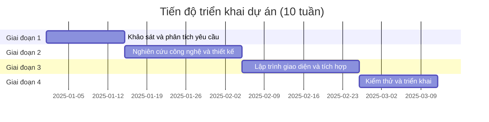
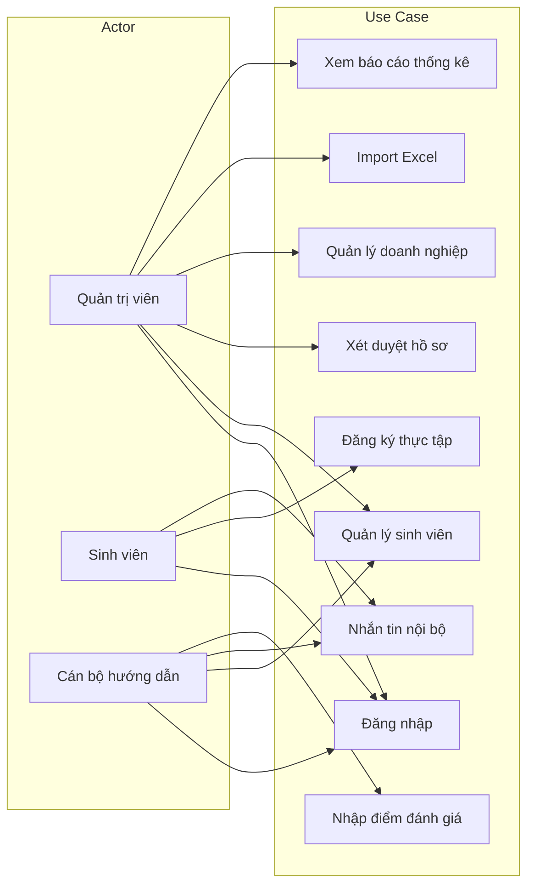

# 2.2. Kế hoạch và tiến độ thực hiện dự án

Sau khi làm quen với môi trường và công cụ, em được giao nhiệm vụ tham gia vào dự án "Xây dựng Website Quản lý thực tập sinh". Để đảm bảo dự án đi đúng hướng và hoàn thành đúng thời hạn, em cùng cán bộ hướng dẫn đã vạch ra một lộ trình thực tập và triển khai dự án cụ thể, được chia thành bốn giai đoạn trọng tâm.

Trong giai đoạn đầu tiên kéo dài từ tuần thứ nhất đến tuần thứ hai, em tập trung vào việc khảo sát và phân tích yêu cầu, tìm hiểu quy trình quản lý thực tập sinh thủ công hiện tại của cơ quan, đồng thời thu thập yêu cầu từ bộ phận nhân sự để lên danh sách các chức năng cần thiết. Bước sang giai đoạn hai từ tuần thứ ba đến tuần thứ năm, công việc chuyển hướng sang nghiên cứu công nghệ và thiết kế hệ thống. Tại đây, em tiến hành nghiên cứu chuyên sâu về hệ sinh thái MERN Stack, vẽ sơ đồ luồng dữ liệu, thiết kế cấu trúc cơ sở dữ liệu và bắt đầu lập trình các giao diện lập trình ứng dụng (API) phía máy chủ. Giai đoạn ba diễn ra từ tuần thứ sáu đến tuần thứ tám, tập trung vào lập trình giao diện và tích hợp. Trong khoảng thời gian này, em thiết kế giao diện người dùng bằng ReactJS, tích hợp các API đã viết và triển khai cấu hình tính năng nhắn tin theo thời gian thực. Cuối cùng, ở giai đoạn bốn trong hai tuần cuối, em tiến hành kiểm thử toàn bộ các chức năng, khắc phục các lỗi phát sinh theo phản hồi của cán bộ hướng dẫn và thực hiện đưa ứng dụng chạy thực tế lên máy chủ nội bộ của Trung tâm.

**[ Chèn Hình 2.3 – Biểu đồ tiến độ triển khai dự án tại đây ]**

*Gợi ý tạo hình: (1) Word: Insert → SmartArt → Process, vẽ 4 bước nối tiếp: Giai đoạn 1 (Khảo sát) → Giai đoạn 2 (Thiết kế) → Giai đoạn 3 (Lập trình) → Giai đoạn 4 (Triển khai). Hoặc (2) Chụp màn hình bảng quản lý công việc (Trello, Jira, Excel). Hoặc (3) Dùng mã Mermaid dưới đây trên [mermaid.live](https://mermaid.live) để xuất ảnh.*

*Chú thích hình: **Hình 2.3: Biểu đồ tiến độ triển khai dự án.***

---

# 2.3. Mô tả bài toán và yêu cầu dự án

Từ quá trình khảo sát thực tế ở giai đoạn đầu, cơ quan đặt ra bài toán cần một nền tảng quản trị nội bộ chuyên biệt để thay thế hoàn toàn cho việc quản lý thực tập sinh rải rác bằng các tệp Excel. Ứng dụng cần được thiết kế với giao diện mang phong cách công nghệ, chuyên nghiệp với tông màu chủ đạo là xanh lam và trắng, đồng thời phải đảm bảo tính trực quan và dễ thao tác cho người sử dụng. Hệ thống phải đáp ứng được các yêu cầu chức năng cốt lõi được chia thành nhiều khối nghiệp vụ khác nhau. Khối đầu tiên là xác thực và phân quyền, yêu cầu hệ thống phải có trang đăng nhập bảo mật, tự động nhận diện tài khoản là Quản trị viên, Sinh viên hay Cán bộ doanh nghiệp để hiển thị bảng điều khiển và các chức năng tương ứng.

Đối với khối quản lý nghiệp vụ dành cho Quản trị viên, hệ thống cần cung cấp giao diện xem báo cáo thống kê bằng biểu đồ, cho phép xét duyệt hồ sơ sinh viên, quản lý thông tin doanh nghiệp và đặc biệt là tính năng tải lên tệp Excel để nhập liệu hàng loạt. Đối với khối tương tác, sinh viên cần không gian để cập nhật hồ sơ cá nhân và nộp thư giới thiệu, trong khi cán bộ hướng dẫn có thể xem danh sách sinh viên mình quản lý và nhập điểm đánh giá. Cuối cùng, khối giao tiếp thời gian thực yêu cầu tích hợp một cửa sổ trò chuyện ngay trên hệ thống để sinh viên, nhà trường và doanh nghiệp có thể nhắn tin trao đổi công việc trực tiếp mà không cần phụ thuộc vào ứng dụng giao tiếp của bên thứ ba.

**[ Chèn Hình 2.4 – Biểu đồ Use Case tổng quan của hệ thống tại đây ]**

*Gợi ý tạo hình: Dùng [draw.io](https://draw.io) hoặc StarUML: vẽ 3 Actor (hình người que) — Quản trị viên, Sinh viên, Cán bộ hướng dẫn — và các Use Case (hình oval): Đăng nhập, Quản lý sinh viên, Xét duyệt hồ sơ, Đăng ký thực tập, Quản lý doanh nghiệp, Import Excel, Nhắn tin nội bộ, Xem báo cáo thống kê, Nhập điểm đánh giá... Nối Actor với Use Case tương ứng. Sau đó export ảnh PNG và chèn vào đây.*

*Mermaid không hỗ trợ sơ đồ Use Case chuẩn (actor + oval). Dưới đây là sơ đồ dạng flowchart thể hiện vai trò và chức năng, có thể dùng tạm hoặc kết hợp với ảnh vẽ từ draw.io.*

*Chú thích hình: **Hình 2.4: Biểu đồ Use Case tổng quan của hệ thống.** (Nên dùng ảnh vẽ từ draw.io/StarUML để đúng chuẩn Use Case; sơ đồ trên chỉ mang tính minh họa quan hệ Actor – chức năng.)*
