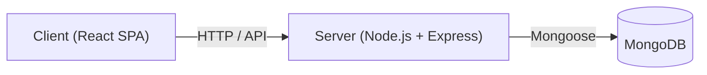
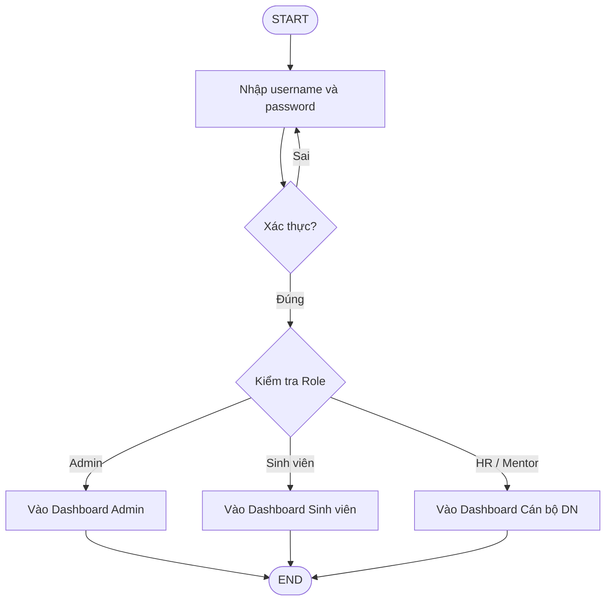
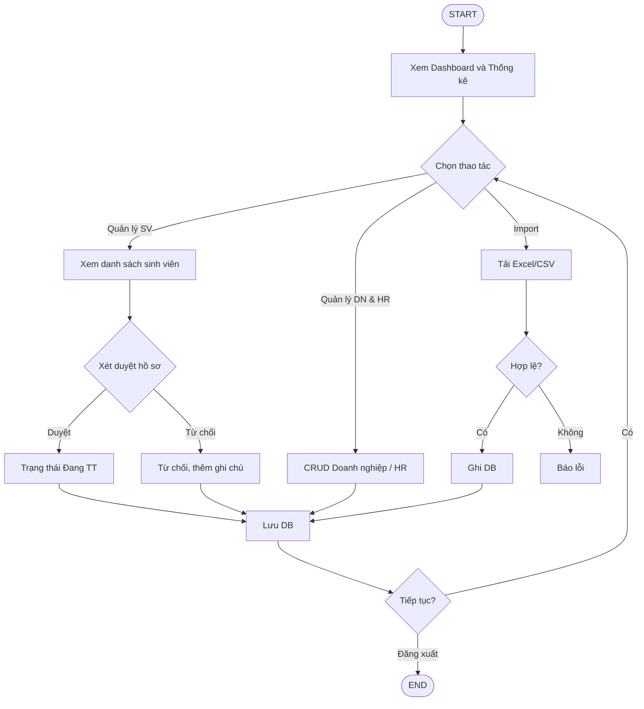
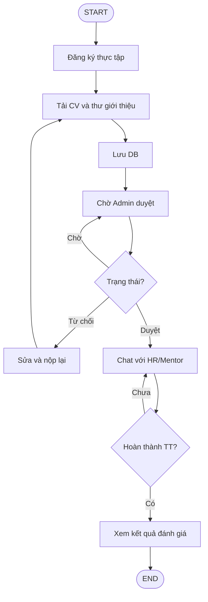
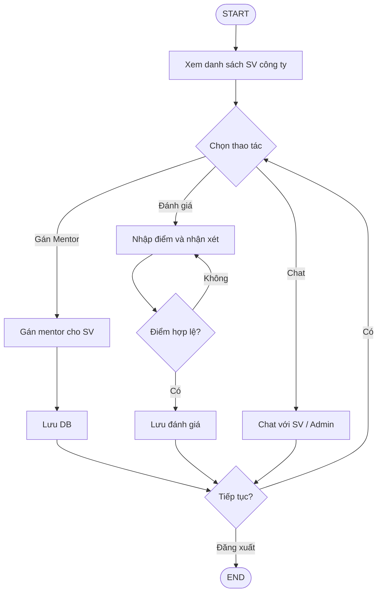
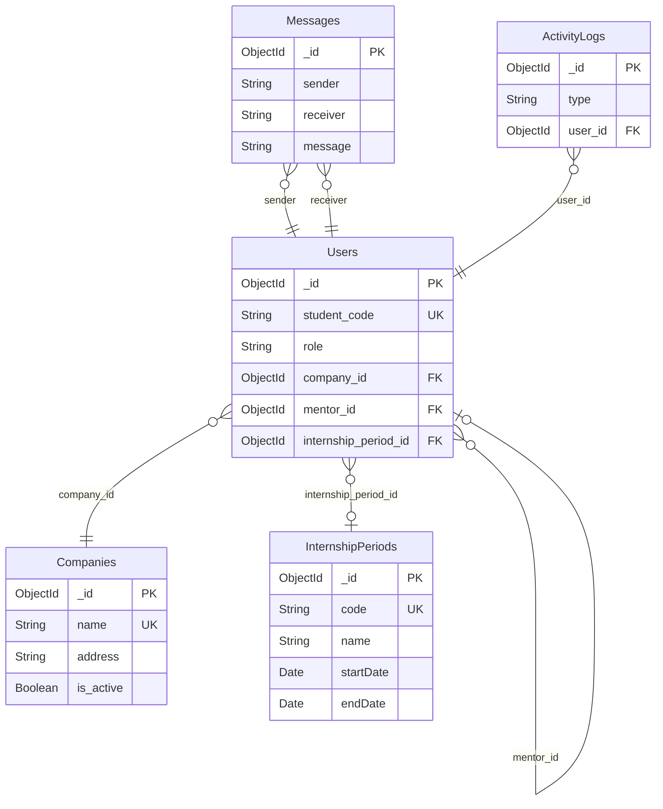

# Placeholder hình Chương 2 (Hình 2.5 – 2.10)

*Copy từng khối dưới đây vào đúng vị trí trong báo cáo (Word hoặc file .md). Có thể dùng draw.io hoặc StarUML để vẽ các sơ đồ, sau đó export ảnh PNG/SVG và chèn thay cho dòng placeholder.*

---

**[ Ông chèn hình ảnh Sơ đồ kiến trúc Client-Server-Database vào đây ]**

**Hình 2.5:** Sơ đồ kiến trúc tổng thể của hệ thống.

---

**[ Ông chèn hình ảnh Flowchart Luồng Đăng nhập vào đây ]**

**Hình 2.6:** Lưu đồ thuật toán chức năng Đăng nhập và Phân quyền.

---

**[ Ông chèn hình ảnh Flowchart Luồng Admin vào đây ]**

**Hình 2.7:** Lưu đồ luồng xử lý nghiệp vụ của Quản trị viên.

---

**[ Ông chèn hình ảnh Flowchart Luồng Sinh viên vào đây ]**

**Hình 2.8:** Lưu đồ luồng xử lý nghiệp vụ của Sinh viên.

---

**[ Ông chèn hình ảnh Flowchart Luồng HR/Mentor vào đây ]**

**Hình 2.9:** Lưu đồ luồng xử lý nghiệp vụ của Cán bộ doanh nghiệp.

---

**[ Ông chèn hình ảnh Sơ đồ quan hệ Database - các Collection vào đây ]**

**Hình 2.10:** Sơ đồ thiết kế các Collection trong cơ sở dữ liệu MongoDB.

---

**Gợi ý công cụ vẽ:**
- **draw.io** (https://draw.io): mở file `So_do_Chuong_2.drawio` trong thư mục này (đã có sẵn Hình 2.5 và 2.6), chỉnh sửa rồi export PNG/SVG. Hoặc copy mã Mermaid bên dưới vào mermaid.live → export ảnh → trong draw.io chọn Insert → Image để chèn ảnh vào.
- **StarUML**: vẽ flowchart, Use Case; export ảnh.
- **Mermaid** (https://mermaid.live): dán từng khối code bên dưới → Export PNG/SVG → dùng ảnh trong Word hoặc chèn vào draw.io làm nền để vẽ lại.

---

## Mã Mermaid – copy vào mermaid.live rồi export ảnh, sau đó chèn ảnh vào draw.io (Insert → Image)

### Hình 2.5 – Kiến trúc Client-Server-Database

### Hình 2.6 – Đăng nhập và Phân quyền

### Hình 2.7 – Luồng Quản trị viên

### Hình 2.8 – Luồng Sinh viên

### Hình 2.9 – Luồng Cán bộ doanh nghiệp (HR/Mentor)

### Hình 2.10 – Sơ đồ các Collection MongoDB

